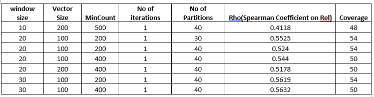

## [Train Word2Vec Word Embedding Model](2_Train_Word2Vec.ipynb)
This [Notebook](2_Train_Word2Vec.ipynb) covers how you can train, evaluate and visualize word embeddings using **[Word2Vec](https://arxiv.org/pdf/1301.3781.pdf)** implementaion from **[MLLib](https://spark.apache.org/docs/latest/mllib-feature-extraction.html#word2vec)** 
in **Spark**. The MLLib function for word2vec is based on a continuos skip-gram model that tries to predict the context words given a word. To optimse the performance this implementation uses hierarchical softmax. H-SoftMax 
essentially replaces the flat SoftMax layer with a hierarchical layer that has the words as leaves. This allows us to decompose calculating the probability of one word into a sequence of probability calculations, 
which saves us from having to calculate the expensive normalization over all words. The algorithm has several hyper-parameters which can be tuned to obtain better performance. These are windowSize, vectorSize etc. (We 
define the meaning of each parameter in step 5). results for hyper parameter tuning are present in the end. Let's begin extracting word embeddings for Bio-medical terms.

We are going to use the XML files we downloaded in [section 1](../../01_DataPreparation/1_Download_and_Parse_Medline_Abstracts.ipynb)

- Step 1: Import the required libraries and point the path to the directory where you downloaded the XML files.

- Step 2: Combine all the data from these XMLs into a single dataframe and store this new dataframe in the Parquet format so that we can read it quickly in the next runs. This may take about 15-30 mins depending on the size of your 
spark cluster.

- Step 3: (Optional) If you have a dictionary of Words that you care about and want to exclude any abstracts that do not contain words from this dictionary you can uncomment the filtering code.

- Step 4: Do some basic preprocessing on the abstracts and load test sets for evaluation. 

- Step 5: Train Word2Vec model using the Continuous Skip-gram Model (We use the MLlib Word2Vec function for this). Set the parameters of the model based on your requirements 

        windowSize (number of words of the left and right eg. window size of 2 means 2 words to the left and 2 to the right of the current word.)
        vectorSize (size of the embeddings),
        minCount (minium number of occurences of a word to be included in the output)
        numPartitions (number of partitions used for training, keep a small number for accuracy)

Note: The time it takes to run the Word2Vec depends on the parameters you specify as well as the size of your cluster.

- Step 6: Intrinsic Evaluation of the Word Vectors. We evaluate the cosine similarity between the vectors of the pair of terms. Each pair is annotated for similarity by humans. The score given is on an arbitary scale. Hence, to compare we 
 use the [Spearman Correlation](https://en.wikipedia.org/wiki/Spearman%27s_rank_correlation_coefficient) between the scores predicted by the model and those assigned by humans. 

- Step 7: Save the Word Embeddings in Parquet format

- Step 8: Visualization with PCA. We split the word embeddings into columns of a dataframe, save the embeddings and apply PCA on it. We then plot some words (We plot a few terms related to Pnemonia and a few terms related to Colon Cancer) 
 and see the clusters formed (Ideally similar Words should be closer to each other)
 We can also save these embeddings in a TSV format and plot it using tensorboard or [Projector for Tensorflow](http://projector.tensorflow.org/). Refer to the first section of the [next notebook](../../02_Modeling/02_ModelCreation/3_Training_Neural_Entity_Extractor_Pubmed.ipynb) to see how you can extract the word embeddings from parquet files.

- Step 9: Visualization using t-SNE and PCA. t-SNE helps to get better visualizations for the terms, but since it is computationally expensive we first use PCA to scale the vector size down to 45 and then select 15000 words and apply t-SNE on 
this reduced word set. We notice that this results in better visualization when compared to just PCA.

#### Notes:

- Hyper-Parameter Tuning: Showing the effect of hyper-parameters on the performance of intrinsic task.

 From the below table we see that having a higher window size is better for the intrinsic evaluation since it helps to get more context about the word but in reality it may
 actually be very noisy to keep a larger context. We also see having a larger mincount is giving better results but it is also decreasing the coverage over the test set, hence its advisable to keep micount as a low number.
 The numbers here are reported on a spark cluster having 11 worker nodes with each worker node with 4 cores. The runtime for most of the evaluations is under 30 mins because of the large number of partitions. If speed 
 is the main concern then number of partitions should be as high as possible (but less than the total number of cores), however if the concer is accuracy the number of partitions should be a lower number (it will take more time).

&nbsp;&nbsp;&nbsp;&nbsp;&nbsp;&nbsp;&nbsp;&nbsp;&nbsp;&nbsp;&nbsp;&nbsp;

- Intrinsic Task Vs Extrinsic Task

 We noticed that parameters which are good for Intrinsic Evaluation are not the best for Extrinsic Evaluation (Neural Entity Extraction). In particular, keeping a large window size helped intrinsic evaluation but not 
 extrinsic. 

- PCA + t-SNE

 Visualization through PCA was not very effective, primarily because of loss of information when we scal down the vectors to 2 dimensions. We found t-SNE to be much better in terms of visualization. [t-SNE](https://en.wikipedia.org/wiki/T-distributed_stochastic_neighbor_embedding) at its core
 works in two steps. First it creates a probability distribution over the pairs in the higher dimensional space in a way that similar objects have a high probability of being picked and dissimilar points have very
 low probability of getting picked. Next, it defines a similar probability distribution over the points in a low dimensional map and minimizes the KL Divergence between the two distributions with respect to location 
 of points on the map.

- Memory Issues

 While working with spark there might be a few places where you may get Memory Exceptions. For example, while downloading the XML files it is advisable to continuosly store the data rather than wait for storing after completing the 
 entire processing. Another place is using Word2vec with very small mincount, high vector size, low number of partitions. If the dataset you are working with is as huge as the Medline then it is advisable to test the 
 performance on a sampled dataset like (10% or so) and then scale the parameters.
