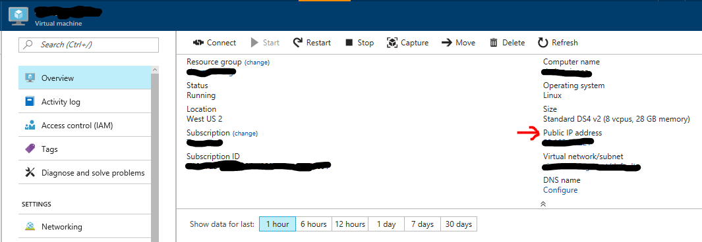
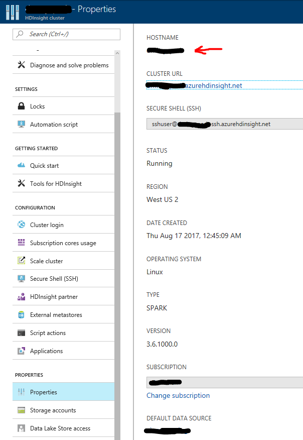

# Biomedical Entity Recognition using TDSP Template


## Introduction

The aim of this real-world scenario is to highlight how to use Azure Machine Learning Workbench to solve a complicated NLP task such as entity extraction from unstructured text. Here are the key points:

1. How to train a neural word embeddings model on a text corpus of about 18 million PubMed abstracts using [Spark Word2Vec implementation](https://spark.apache.org/docs/latest/mllib-feature-extraction.html#word2vec).
2. How to build a deep Long Short-Term Memory (LSTM) recurrent neural network model for entity extraction on a GPU-enabled Azure Data Science Virtual Machine (GPU DSVM) on Azure.
2. Demonstrate that domain-specific word embeddings model can outperform generic word embeddings models in the entity recognition task. 
3. Demonstrate how to train and operationalize deep learning models using Azure Machine Learning Workbench.

4. Demonstrate the following capabilities within Azure Machine Learning Workbench:

    * Instantiation of [Team Data Science Process (TDSP) structure and templates](how-to-use-tdsp-in-azure-ml.md).
    * Automated management of your project dependencies including the download and the installation 
    * Execution of code in Jupyter notebooks as well as Python scripts.
    * Run history tracking for Python files.
    * Execution of jobs on remote Spark compute context using HDInsight Spark 2.1 clusters.
    * Execution of jobs in remote GPU VMs on Azure.
    * Easy operationalization of deep learning models as web-services on Azure Container Services.

## Use Case Overview
Biomedical named entity recognition is a critical step for complex biomedical NLP tasks such as: 
* Extraction of diseases, symptoms from electronic medical or health records.
* Drug discovery
* Understanding the interactions between different entity types such as drug-drug interaction, drug-disease relationship and gene-protein relationship.

Our use case scenario focuses on how a large amount of unstructured data corpus such as Medline PubMed abstracts can be analyzed to train a word embedding model. Then the output embeddings are considered as automatically generated features to train a neural entity extractor.

Our results show that the biomedical entity extraction model training on the domain-specific word embedding features outperforms the model trained on the generic feature type. The domain-specific model can detect 7012 entities correctly (out of 9475) with F1-score of 0.73 compared to 5274 entities with F1-score of 0.61 for the generic model.

The following figure shows the architecture that was used to process data and train models.


## Data Description

### 1. Word2Vec model training data
We first downloaded the raw MEDLINE abstract data from [MEDLINE](https://www.nlm.nih.gov/pubs/factsheets/medline.html). The data is publically available in the form of XML files on their [FTP server](https://ftp.ncbi.nlm.nih.gov/pubmed/baseline). There are 892 XML files available on the server and each of the XML files has the information of 30,000 articles. More details about the data collection step are provided in the Project Structure section. The fields present in each file are 
        
        abstract
        affiliation
        authors
        country	
        delete: boolean if False means paper got updated so you might have two XMLs for the same paper.
        file_name	
        issn_linking	
        journal	
        keywords	
        medline_ta: this is abbreviation of the journal nam	
        mesh_terms: list of MeSH terms	
        nlm_unique_id	
        other_id: Other IDs	
        pmc: Pubmed Central ID	
        pmid: Pubmed ID
        pubdate: Publication date
        title

### 2. LSTM model training data

The neural entity extraction model has been trained and evaluated on publiclly available datasets. To obtain a detailed description about these datasets, you could refer to the following sources:
 * [Bio-Entity Recognition Task at BioNLP/NLPBA 2004](http://www.nactem.ac.uk/tsujii/GENIA/ERtask/report.html)
 * [BioCreative V CDR task corpus](http://www.biocreative.org/tasks/biocreative-v/track-3-cdr/)
 * [SemEval 2013 - Task 9.1 (Drug Recognition)](https://www.cs.york.ac.uk/semeval-2013/task9/)


## Prerequisites

* An Azure [subscription](https://azure.microsoft.com/en-us/free/)
* Azure Machine Learning Workbench. See [installation guide](quick-start-installation.md). Currently the Azure Machine Learning Workbench can be installed on the following operating systems only: 
    * Windows 10 or Windows Server 2016
    * macOS Sierra

### Azure services
* To run this scenario with Spark cluster, provision [Azure HDInsight Spark cluster](https://docs.microsoft.com/en-us/azure/hdinsight/hdinsight-apache-spark-jupyter-spark-sql) (Spark 2.1 on Linux (HDI 3.6)) for scale-out computation. To process the full amount of MEDLINE abstracts discussed below, We recommend having a cluster with:
    * a head node of type [D13_V2](https://azure.microsoft.com/en-us/pricing/details/hdinsight/) 
    * at least four worker nodes of type [D12_V2](https://azure.microsoft.com/en-us/pricing/details/hdinsight/). 

    * To maximize performance of the cluster, we recommend to change the parameters spark.executor.instances, spark.executor.cores, and spark.executor.memory by following the instructions [here](https://docs.microsoft.com/en-us/azure/hdinsight/hdinsight-apache-spark-jupyter-spark-sql) and editing the definitions in "custom spark defaults" section. 

* You can run the entity extraction model training locally on a [Data Science Virtual Machine (DSVM)](https://docs.microsoft.com/en-us/azure/machine-learning/machine-learning-data-science-linux-dsvm-intro) or in a remote Docker container in a remote DSVM.

* To provision DSVM for Linux (Ubuntu), follow the instructions [here](https://docs.microsoft.com/en-us/azure/machine-learning/machine-learning-data-science-provision-vm). We recommend using [NC6 Standard (56 GB, K80 NVIDIA Tesla)](https://docs.microsoft.com/en-us/azure/machine-learning/machine-learning-data-science-linux-dsvm-intro).

### Python packages

All the required dependencies are defined in the aml_config/conda_dependencies.yml file under the scenario project folder. The dependencies defined in this file will be
automatically provisioned for runs against docker, VM, and HDI cluster targets. For details about the Conda environment file format, refer to [here](https://conda.io/docs/using/envs.html#create-environment-file-by-hand).

* [TensorFlow with GPU support](https://www.tensorflow.org/install/)
* [CNTK 2.0](https://docs.microsoft.com/en-us/cognitive-toolkit/using-cntk-with-keras)
* [Keras](https://keras.io/#installation)
* NLTK
* Fastparquet

### Basic instructions for Azure Machine Learning (AML) Workbench
* [Overview](overview-what-is-azure-ml.md)
* [Installation](quick-start-installation.md)
* [Using TDSP](how-to-use-tdsp-in-azure-ml.md)
* [How to read and write files](how-to-read-write-files.md)
* [How to use Jupyter Notebooks](how-to-use-jupyter-notebooks.md)
* [How to use GPU](how-to-use-gpu.md)

## Scenario Structure
For the scenario, we use the TDSP project structure and documentation templates (Figure 1), which follows the [TDSP lifecycle](https://github.com/Azure/Microsoft-TDSP/blob/master/Docs/lifecycle-detail.md). Project is created based on instructions provided [here](https://github.com/amlsamples/tdsp/blob/master/docs/how-to-use-tdsp-in-azure-ml.md).


 

### Configuration of execution environments

This project includes steps that run on two compute/execution environments: in Spark cluster and GPU-supported DS VM. We start with the description of the dependencies required both environments. 

To install these packages in Docker image and in the nodes of Spark cluster, we modify conda_dependencies.yml file:

    name: project_environment    
    dependencies:
    - python=3.5.2
    # ipykernel is required to use the remote/docker kernels in Jupyter Notebook.
    - ipykernel=4.6.1
    - tensorflow-gpu==1.2.0
    - nltk
    - requests
    - lxml
    - unidecode
    - pip:
        # This is the operationalization API for Azure Machine Learning. Details:
        # https://github.com/Azure/Machine-Learning-Operationalization
        - azure-ml-api-sdk==0.1.0a6
        - h5py==2.7.0
        - matplotlib
        - fastparquet
        - keras
        - azure-storage

The modified conda\_dependencies.yml file is stored in aml_config directory of this project. 

In the next steps, we connect execution environment to Azure account. Open command line window (CLI) by clicking File menu in the top left corner of AML Workbench and choosing "Open Command Prompt." Then run in CLI

    az login

You get a message

    To sign in, use a web browser to open the page https://aka.ms/devicelogin and enter the code <code> to authenticate.

Go to this web page, enter the code and sign into your Azure account. After this step, run in CLI

    az account list -o table

and find the subscription ID of Azure subscription that has your AML Workbench Workspace account. Finally, run in CLI

    az account set -s <subscription ID>

to complete the connection to your Azure subscription.

In the next two sections we show how to complete configuration of remote docker and Spark cluster.

#### Configuration of remote Docker container

 To set up a remote Docker container, run the following command in the CLI:
```
    az ml computetarget attach --name my-dsvm-env --address <IP address> --username <username> --password <password> --type remotedocker
```
with IP address, user name and password in DSVM. IP address of DSVM can be found in Overview section of your DSVM page in Azure portal:



This command creates two files my-dsvm-env.compute and my-dsvm-env.runconfig under aml_config folder.

#### Configuration of Spark cluster

To set up Spark environment, run the following command in the CLI:
```
    az ml computetarget attach --name my-spark-env --address <cluster name>-ssh.azurehdinsight.net  --username <username> --password <password> --type cluster
```
with the name of the cluster, cluster's SSH user name and password. The default value of SSH user name is `sshuser`, unless you changed it during provisioning of the cluster. The name of the cluster can be found in Properties section of your cluster page in Azure portal:



This command creates two files my-spark-env.compute and my-spark-env.runconfig under aml_config folder.

The step-by-step data science workflow is as follows:
### 1. [Data Acquisition and Understanding](./code/01_data_acquisition_and_understanding/ReadMe.md)
### 2. [Modeling](./code/02_modeling/ReadMe.md)
#### 2.1. [Feature generation](./code/02_modeling/01_feature_engineering/ReadMe.md)
#### 2.2. [Train the neural entity extractor](./code/02_modeling/02_model_creation/ReadMe.md)
#### 2.3. [Model evaluation](./code/02_modeling/03_model_evaluation/ReadMe.md)
### 3. [Deployment](./code/03_deployment/ReadMe.md)


## Conclusion

This use case scenario demonstrate how to train a word embedding model using Word2Vec algorithm on Spark and then use the extracted embeddings as features to train a deep neural network for entity extraction. We have applied the training pipeline on the biomedical domain. However, the pipeline is generic enough to be applied to detect custom entity types of any other domain. You just need enough data and you can easily adapt the workflow presented here for a different domain.

## References

* Tomas Mikolov, Kai Chen, Greg Corrado, and Jeffrey Dean. 2013a. Efficient estimation of word representations in vector space. In Proceedings of ICLR.
* Tomas Mikolov, Ilya Sutskever, Kai Chen, Greg S Corrado, and Jeff Dean. 2013b. Distributed representations of words and phrases and their compositionality. In Proceedings of NIPS, pages 3111–3119.
* Billy Chiu, Gamal Crichton, Anna Korhonen and Sampo Pyysalo. 2016. [How to Train Good Word Embeddings for Biomedical NLP](http://aclweb.org/anthology/W/W16/W16-2922.pdf), In Proceedings of the 15th Workshop on Biomedical Natural Language Processing, pages 166–174.
* [Vector Representations of Words](https://www.tensorflow.org/tutorials/word2vec)
* [Recurrent Neural Networks](https://www.tensorflow.org/tutorials/recurrent)
* [Problems encountered with Spark ml Word2Vec](https://intothedepthsofdataengineering.wordpress.com/2017/06/26/problems-encountered-with-spark-ml-word2vec/)
* [Spark Word2Vec: lessons learned](https://intothedepthsofdataengineering.wordpress.com/2017/06/26/spark-word2vec-lessons-learned/)


## Contributing

This project welcomes contributions and suggestions. Most contributions require you to agree to a Contributor License Agreement (CLA) declaring that you have the right to, and actually do, grant us the rights to use your contribution. For details, visit https://cla.microsoft.com.
When you submit a pull request, a CLA-bot will automatically determine whether you need to provide a CLA and decorate the PR appropriately (e.g., label, comment). Simply follow the instructions provided by the bot. You will only need to do this once across all repos using our CLA.
This project has adopted the Microsoft Open Source Code of Conduct. For more information see the Code of Conduct FAQ or contact opencode@microsoft.com with any additional questions or comments.
