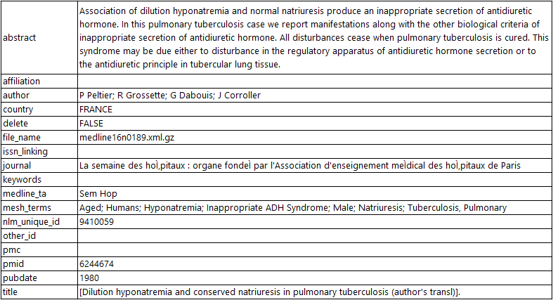

## 1. Data Acquisition and Understanding
### [Download and Parse MEDLINE Abstracts](1_Download_and_Parse_XML_Spark.py)

The raw MEDLINE corpus has a total of 27 million abstracts where about 10 million articles have an empty abstract field. The total size of the downloaded files is 22 GB. Azure HDInsight Spark is used to process big data that cannot be loaded into the memory of a single machine as a [Pandas DataFrame](https://pandas.pydata.org/pandas-docs/stable/generated/pandas.DataFrame.html).

### Objective

The [companion script](1_Download_and_Parse_XML_Spark.py) covers how to:
   * download the MEDLINE XML files from [Medline site](ftp.ncbi.nlm.nih.gov) (see the download_xml_gz_files() function) to the head node of the Spark cluster, 
   * parse them using the publically available XML parser [pubmed_parser](https://github.com/titipata/pubmed_parser), 
   * save the abstracts into TSV files and
   * upload the TSV files to the blob storage container associated with the spark cluster (see the process_files() function in the Python script).

To upload these files to a different blob storage, create blob storage container 'dataset' in your storage account. You can do that by going to Azure page of your storage account, clicking Blobs and then clicking +Container. Enter 'dataset' as Name and click OK. The following screenshots illustrate these steps:


The upload of the files takes several minutes, depending on your Internet connection. 

### Execution Steps 

 First, the data is downloaded into the Spark cluster. Then the following steps are executed on the [Spark DataFrame](https://spark.apache.org/docs/latest/sql-programming-guide.html): 
* parse the XML files using Medline XML Parser
* preprocess the abstract text including sentence splitting, tokenization and case normalization.
* exclude articles where abstract field is empty or has short text 
* create the word vocabulary from the training abstracts
* train the word embedding neural model. You can refer to this [Python script](../01_feature_engineering/2_Train_Word2Vec_Model_Spark.py) and its [documentation](../01_feature_engineering/ReadMe.md) to get started.

After parsing the Medline XML files, each data record has the following format: 



The neural entity extraction model has been trained and evaluated on publicly available datasets. To obtain a detailed description about these datasets, you could refer to the following sources:
 * [Bio-Entity Recognition Task at BioNLP/NLPBA 2004](http://www.nactem.ac.uk/tsujii/GENIA/ERtask/report.html)
 * [BioCreative V CDR task corpus](http://www.biocreative.org/tasks/biocreative-v/track-3-cdr/)
 * [Semeval 2013 - Task 9.1 (Drug Recognition)](https://www.cs.york.ac.uk/semeval-2013/task9/)
 
### How to run this script

To run this script into the HDInsight Spark cluster, 
1. Run the Azure ML Workbench installed into your DS VM.
2. Open command line window (CLI) by clicking File menu in the top left corner of AML Workbench and choosing "Open Command Prompt." 
3. Then run the following command in the CLI window:
```
    az ml experiment submit -c myspark 1_Download_and_Parse_XML_Spark.py   
```

   where myspark is the Spark environment defined in the [configuration step](../../ReadMe.md).

### Notes
- There are more that 800 XML files that are present on the Medline ftp server. The shared code downloads them all which takes a long time. If you just want to test the code, you can change that and download only a subsample.
- The source code of the PubMed Parser is also included in the repository.

### Next Step
2. [Modeling](../02_modeling/ReadMe.md)

