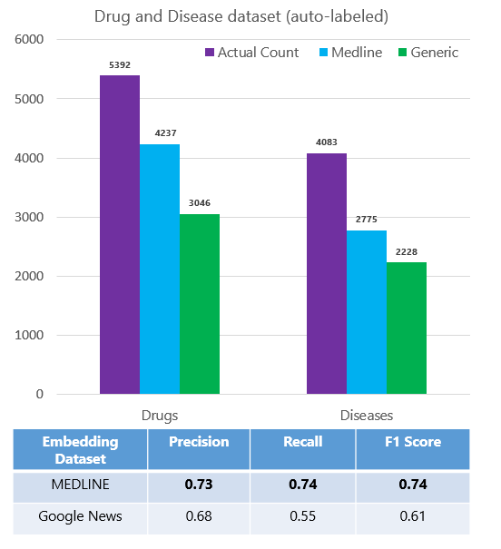
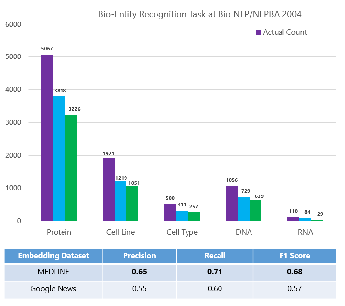
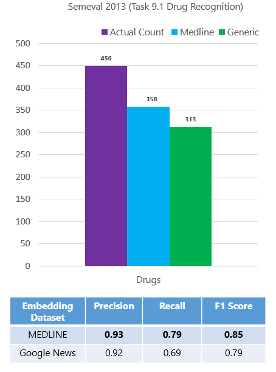
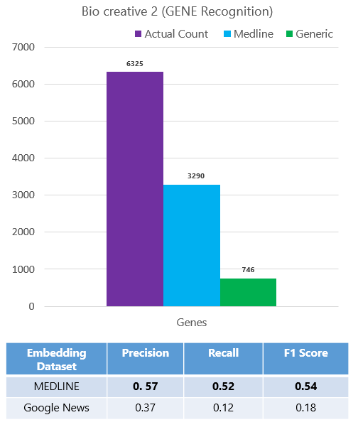
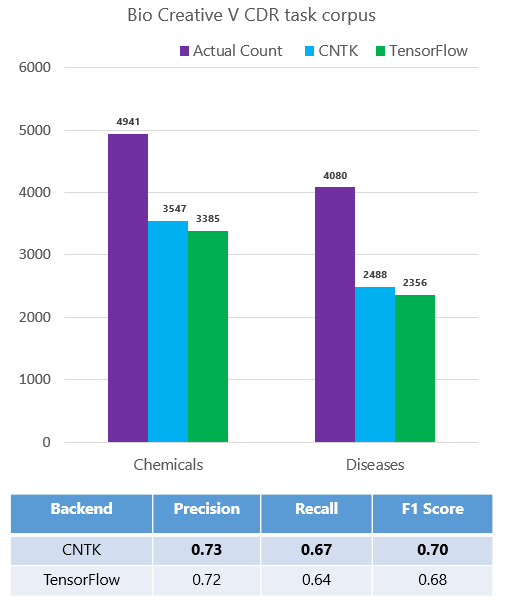

## 2.3. [Model Evaluation](4_Test_Entity_Extractor_GPU.py)

### Objective

The aim of the [companion script](4_Test_Entity_Extractor_GPU.py) is to show how to evaluate the accuracy of the Keras LSTM neural network trained previously in the [Model Creation Phase](02_modeling/02_model_creation/ReadMe.md) using Azure ML workbench. It uses the evaluation script from the shared task [Bio-Entity Recognition Task at Bio NLP/NLPBA 2004](http://www.nactem.ac.uk/tsujii/GENIA/ERtask/report.html) to evaluate the precision, recall, and F1 score of the model. 

### How to run this script

#### 1. Execution in local environment 
If you have Azure ML Workbench installed into your DS VM and would like to run this script locally into the DS VM, 
1. Run the Azure ML Workbench installed into your DS VM.
2. Open command line window (CLI) by clicking File menu in the top left corner of AML Workbench and choosing "Open Command Prompt." 
3. Then run the following command in the CLI window:
```
    az ml experiment submit -c local 4_Test_Entity_Extractor_GPU.py   
``` 

#### 2. Execution in a Docker container in a remote VM
If you have Azure ML Workbench installed into your desktop or laptop and would like to run this script remotely into the DS VM, 
1. Run the Azure ML Workbench installed into your desktop or laptop.
2. Open command line window (CLI) by clicking File menu in the top left corner of AML Workbench and choosing "Open Command Prompt." 
3. Then run the following command in the CLI window:
```
    az ml experiment submit -c myvm 4_Test_Entity_Extractor_GPU.py   
```
    where myvm is the remote Docker container environment defined in the [configuration step](../../../ReadMe.md).

### Execution Steps 

 * Step 1: Copy the dataset and evaluation scripts to correct locations and Read Word Embeddings from Parquet Files:
We are using the [fastparquet package](https://pypi.python.org/pypi/fastparquet) as a way to read the embeddings from the parquet files and load them to a Pandas dataframe. You can then store this embedding matrix 
in any format and use it either as a TSV to visualize using the [Projector for Tensorflow](http://projector.tensorflow.org/) or use as a lookup table for downstream Deep Learning Tasks. The code provides a way to download the files from the Blob connected to your Spark Cluster. For more information about Azure blob storage, refer to [here](https://docs.microsoft.com/en-us/azure/storage/storage-dotnet-how-to-use-blobs)

* Step 2: Prepare the data for training and testing in a format that is suitable for Keras. The DataReader/read_and_parse_training_data function is the one that does that.
 - It first reads the word embeddings and a word_to_index_map mapping each word in the embeddings to an index. It also creates a list where each item id refers to the the word vector corresponding to that index and hence to its word.
 - Next it reads the training and testing data line by line and appends a sentence to a list. It also creates one-hot vectors for each of the supported entity types (such as B-Disease, I-Disease, B-Drug etc.)
 - Once the list of sentences is ready, its time now to replace each word with its index from the above map. If we find a word which is not present in our vocabulary, we replace the word by the token "UNK".
 To generate the vector for "UNK" we sample a random vector, which has the same dimension as our embeddings, from a Normal Distribution. Since the number of words in each sentence might differ, we pad each sequence 
 to make sure that they have the same length. We add an additional tag "NONE" for each of the padded term. We also associate a zero vector with the paddings. The final shape of the train and test data should be (number of samples, max_sequence_length). This is the shape that can be fed to the [Embedding Layer](https://keras.io/layers/embeddings/) in Keras. Once we have this shape for our dataset we are ready for training our neural network (but first lets create one).
 
 * Step 4: laod the trained model in the [Model Creation Phase](02_modeling/02_model_creation/ReadMe.md).

* Step 5: We store the predictions obtained from the previous step into a text file. The first step here will to combine that output and obtain a file in the 
following format

        Word1   Tag1
        Word2   Tag2
        Word3   Tag3

        Word4   Tag4
        Word5   Tag5

   Once we have the output in the above format we can use the SharedTaskEvaluation Script to obtain the recall, precision and F1-score for our Model.


### In-domain versus generic word embedding models

The following is a comparison between the accuracy of two feature types: (1) word embeddings trained on PubMed abstracts and (2) word embeddings trained on Google News. We clearly see that the in-domain model outperforms the generic model. Hence having a specific word embedding model rather than using a generic one is much more helpful. 

* Task #1: Drugs and Diseases Detection



We perform the evaluation of the in-domain word embeddings on other datasets. The results have shown that entity extraction model trained on in-domain embeddings outperform the model trained on generic features. 

* Task #2: Proteins, Cell Line, Cell Type, DNA and RNA Detection



* Task #3: Chemicals and Diseases Detection


* Task #4: Drugs Detection



* Task #5: Genes Detection



### TensorFlow versus CNTK
All the reported models are trained using Keras with TensorFlow as backend. Keras with CNTK backend does not support "reverse" at the time this work was done. Therefore, for the sake of comparison, we have trained a unidirectional LSTM model with the CNTK backend and compared it to a unidirectional LSTM model with TensorFlow backend. Install CNTK 2.0 for Keras from [here](https://docs.microsoft.com/en-us/cognitive-toolkit/using-cntk-with-keras). 



We concluded that CNTK performs as good as Tensorflow both in terms of the training time taken per epoch (60 secs for CNTK and 75 secs for Tensorflow) and the number of test entities detected. We are using the Unidirectional layers for evaluation.

### Notes

* Loading a pre-trained model for predictions

The [Python script](4_Test_Entity_Extractor_GPU.py) shows how to load a pre-trained neural entity extractor model (like the one trained in the previous step). This will be useful if you want to reuse the model 
for scoring at a later stage. The script uses the Keras load_model method. For more information about the functionalities that Keras provides
off-the-shelf for saving and loading deep learning models, refer to [here](https://keras.io/getting-started/faq/#how-can-i-save-a-keras-model).


### Next Step
3. [Deployment](../../03_deployment/ReadMe.md)

